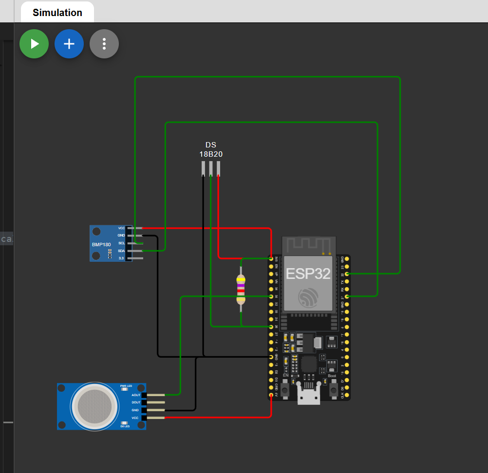

# IoT Sensor Project

## System Architecture & Topology
* Building a heterogeneous sensor node via Wokwi which handles three separate data communication types simultaneously: Digital Bus ($I^2C$), Single Wire Bus (OneWire), and Direct Analog Signaling.

  

## Hardware Interface Specifications 
| Peripheral Sensor | Sensor Pin |ESP32 GPIO Pin | Interface protocol / Notes |
| :-- | :-- | :-- | :-- |
| **BMP180** Pressure | SCL | GPIO 22 | I2C (Serial Clock - 3.3V Logic) |
| **BMP180** Pressure | SDA | GPIO 21 | I2C (Serial Data - 3.3V Logic) |
| **DS18B20** Temperature | DQ | GPIO 26 | OneWire (Requires external 4.7kΩ pull-up to 3.3V) |
| **MQ2** Gas | AOUT | GPIO 35 | Analog (12-bit ADC Input /Max 3.3V Tolerance) |
| **MQ2** Gas | VCC | 5V | 5V Power Input (required for internal heater) |
| **Other Peripherals** | VCC/GND | 3V3/GND | Main Power Distribution Rails | 

## Software Interface Specifications 
* **Libraries Used**: `<Adafruit_BMP085.h>`, `<OneWire.h>`, `<Wire.h>`, and `<DallasTemperature.h>`.
* **Data Units**: Temperature in Celsius, Pressure in Hectopascals, and Gas values as a raw 12-bit ADC integer from 0 to 4095.
* **Bus Robustness:** Implemented active hardware handshaking for the $I^2C$ sequence. The firmware utilizes a blocking guardrail (`while(1)`) on initialization failure to ensure the microcontroller halts execution if a hardware communication fault occurs, preventing downstream data corruption.

## Bottlenecks & Metrics
* **OneWire Conversion Latency:** The DS18B20 temperature sensor is known to be slow because of its distinct internal conversion time (up to 750ms for 12-bit resolution). Utilizing synchronous `delay()` functions to wait for this telemetry may bottleneck the timing loop of the other $I^2C$ and Analog sensors which are faster.
* **ESP32 ADC Non-Linearity:** The internal Analog-to-Digital Converter (ADC) of the ESP32 is known to have non-linear characteristics near the boundary voltages (0V and 3.3V). Analog voltage attenuation trends from the MQ2 Gas sensor will require software calibration curves to maintain accuracy.
* **Bus Contention Guardrails:** If the $I^2C$ clock line experiences transient noise or hardware detachment, the firmware execution loop must include non-blocking timeout hooks to prevent total processor starvation.
* **Calibration Curve for Gas:** Currently, the gas concentration is represented by a 12-bit integer between 0 and 4095. In the future, a calibration curve must be utilized to convert the raw integer to parts-per-million (ppm).

## Execution & Verification Runbook
**To build, compile, and run this project environment locally using standard extensions:**

1. **Environment Setup:** Download and install **VS Code** along with the **PlatformIO IDE** extension.
2. **Simulation Integration:** Install the official **Wokwi** extension inside VS Code and activate a valid user license.
3. **Repository Initialization:** Open this project root directory in VS Code. PlatformIO will automatically read the `platformio.ini` file to configure the ESP32 toolchain.
4. **Local Compilation:** Open the command palette (`Ctrl + Shift + P`), type `Wokwi: Start Simulator`, and press Enter. This compiles local source files using the machine's local processor and executes the interactive circuit canvas instantly.

**Alternatively (Free Web Simulation Bypass - No License Needed):**
1. Clone this repository locally.
2. Build the project locally in VS Code using the PlatformIO Build tool (`Ctrl + Shift + P` $\rightarrow$ `PlatformIO: Build`) to generate the compiled binary target using your local CPU.
3. Locate the compiled image binary path at `.pio/build/esp32dev/firmware.bin`.
4. Open your circuit layout in the web-based **Wokwi browser environment**.
5. Focus on the code editor pane, open the Wokwi command menu (`F1`), select **Upload compiled firmware...**, and upload your local `firmware.bin` file. This runs the simulation instantly, bypassing cloud build servers and local licensing popups.

## Troubleshooting Ledger

### Hardware Architecture
* **OneWire Missing Pull-up Resistor:** During initial testing, the DS18B20 data line failed to communicate. The high-impedance state of the line was introducing floating signal errors. This was resolved by integrating a hardware 4.7kΩ pull-up resistor between the DQ data line and the 3.3V power rail on the simulation canvas to pull the idle state high.

### Software & Simulation Environment
* **Component-Level Emulation Constraints:** Due to environment availability within the Wokwi catalog, a discrete array of three independent sensors was implemented to achieve telemetry capturing. Future hardware iterations plan to migrate this topological layer to a single integrated Bosch BME680 sensor via $I^2C$ to reduce footprint and bus overhead.
* **Virtual Terminal Line Buffering:** Testing revealed a spacing artifact where the Wokwi simulation's virtual console dropped carriage return formatting flags (`\r\n`), bunching strings onto a single terminal line. The underlying firmware logic is verified as functionally accurate; this layout artifact will natively clear when flashing the binary directly to a physical ESP32 board using PlatformIO's native serial monitor.